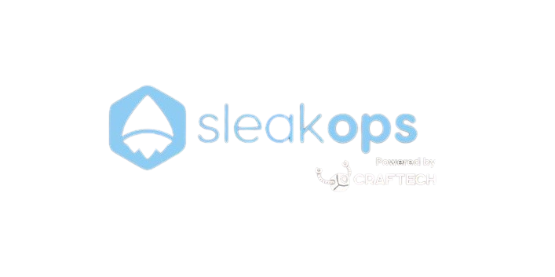

# SleakOps Test Dashboard App

<div align="center">
  
</div>

<h4 align="center">A simple dashboard app built with <a href="https://react.dev/" target="_blank">React</a>, <a href="https://nextjs.org/" target="_blank">NextJs</a> and <a href="https://chakra-ui.com/" target="_blank">Chakra UI</a>.</h4>

<p align="center">
  <a href="#key-features">Key Features</a> •
  <a href="#how-to-use">How To Use</a> •
  <a href="#docker-setup">Docker Setup</a> •
</p>


## Key Features

Simple dashboard menu application. The technologies used were:

- NextJs 15 with app router.
- React and Typescript.
- ChakraUi v2.
- Framer-motion.
- Tailwindcss (only in the loading component).
- Tanstack Query for the fetch and cache of the API response.
- Docker for the app's dockerization and execution.

The Home tab is a chakra block without content, I used it to acclimatize myself to ChakraUi and test some things regarding themes and styles.

The AWS RDS tab is the one that contains the technical test. When you click on it, the fetch is done through Tanstack Query to the API, which returns the results and is displayed in a table that contains the following features:

- Pagination, showing 10 results per page.
- The ability to filter with an input, which allows you to search the results by instance type, database engine, memory and vpcu. It is also available to search by region code, but the code was commented out because all the searches have the same value.
- 2 select fields with all the available options of engine and memory.
- Debounce implemented on the input field. This has the purpose to reduce the number of requests to the API. However, due to the current implementation, results are filtered directly on the client without making a new request, so this feature does not have a impact in performance.
- The results are sorted in order to show last the products with empty fields.
- The table has a button to show the details of each product that leads to a specific page of the product, showing the available options on cards, which are divided into OnDemand or Reserved, with their corresponding data.
- The cards show the product with the following fields: descriptions, vppu, memory, deployment options, price (depending on whether it is by hour or by quantity with that detail), and in the case of Reserved type, the additional options of lease length, purchase options, and offering class are shown.

It is not necessary to configure environment variables, since the API provided by the company is for testing, and the repo is private with access only to whoever requests it.

## How To Use

To clone and run this application from your command line:

```bash
# Clone this repository
$ git clone git@github.com:gonferreyra/sleakops-dashboard-app.git

# Go into the repository
$ cd sleakops-dashboard-app

# Install dependencies
$ npm install

# Run the app
$ npm run dev

```

## Docker Setup

### Prerequisites

- Docker
- Docker Compose

### Running with Docker

1. Clone the repository:

```bash
git clone git@github.com:gonferreyra/sleakops-dashboard-app.git
cd sleakops-dashboard-app
```

2. Start the application using Docker Compose:

```bash
docker-compose up --build
```

The application will be available at: http://localhost:3000

| Command                     | Description                       |
| --------------------------- | --------------------------------- |
| `docker-compose up`         | Start the application             |
| `docker-compose up --build` | Rebuild and start the application |
| `docker-compose down`       | Stor the application              |
| `docker-compose logs -fw`   | view logs in real-time            |

## Development Mode

The application runs in production mode.

## TroubleShooting

if you encounter any issues:

1.  Make sure no other service is using port 3000,
2.  Tryu cleaning Docker cache,

If you encounter any issues with the application, please reach out to the project maintainer.
